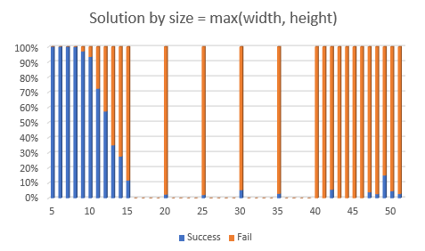
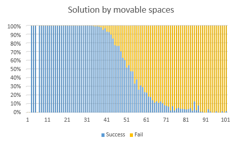
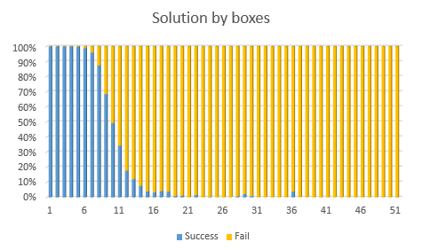

# SokoSolver
Sokoban solver.

## Description
SokoSolver is find a solution to a given Sokoban level.
For the puspose of this task PSPACE-compatible problem may be used.
The original source code is "C++ Unordered Set-based Version" of "https://rosettacode.org/wiki/Sokoban".
SokoSolver is customized followed:
- The map management method from std::vector&lt;std::string&gt; to std::string.
- Not used boost library, and used std::unorderd_set.
- Use original hash method of Table.
- Support '*' (box on goal) and '+' (player on goal) characters.
- Check table has '#' (wall).
- Matching goal tuples, and not matching goal map.
- Maps to be checked can be specified with command line options

## Requirement
SokoSolver will run on Windows (Console application).

## Usage
~~~
Usage: SokoSolver.exe {filename} [-verbose] [-timeout {seconds}]
  -verbose  Enable verbose mode.
  -timeout  Cancel solver by timeout.
~~~

Example:
~~~
SokoSolver.exe -verbose sample/sample1.txt
#######
#     #
#     #
#. #  #
#. $$ #
#.$$  #
#.#  @#
#######

(4,3,D) (4,4,L) (3,6,U) (3,5,L) (1,4,D) (2,5,U) (2,4,U) (3,2,L) (1,1,D) (4,4,L) (3,4,L) (5,5,L) (4,5,L) (3,5,L)
count=1655 open=343 visited=1757
12 msec.
~~~

| sample map  | Original    | Ver1        | Ver1 -2     | Ver2        |
|:------------|------------:|------------:|------------:|------------:|
| sample1.txt |  1708 msec. |   595 msec. |    79 msec. |    12 msec. |
| sample2.txt | 12247 msec. |  4868 msec. |    98 msec. |    15 msec. |
| sample3.txt |    18 msec. |     6 msec. |     0 msec. |     0 msec. |
| sample4.txt |     ? msec. |     ? msec. |     ? msec. |     ? msec. |
| sample5.txt |     ? msec. |     ? msec. | 13198 msec. |  2073 msec. |

## Build
The following environment is necessary to build.
- Visual Studio 2017

Please build with Release x64 mode (Speed priority).
Debug mode is very slow.

# License
GNU General Public License v3.0

# Results
Statistics of this solver program. Sample maps is "https://www.sourcecode.se/sokoban/levels".
Solver program timeout is 180 seconds.

- Map size = max(width, height)

- Movable spaces

- Boxes

